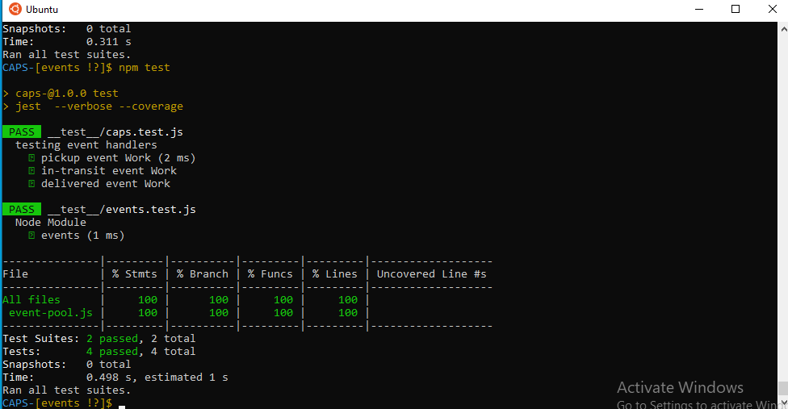
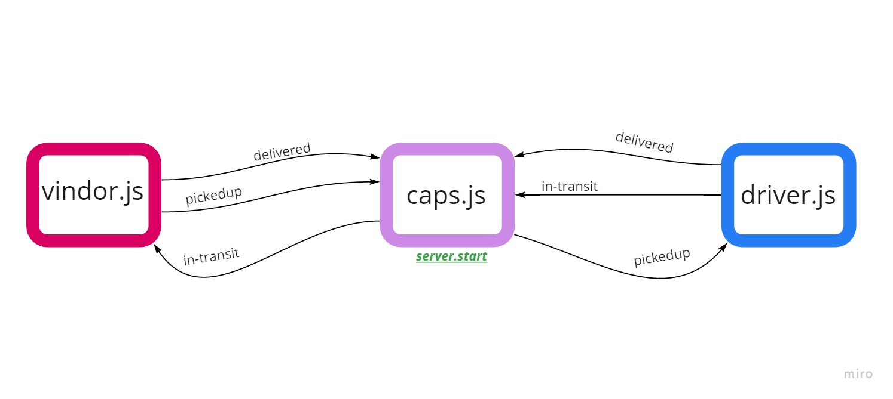

# CAPS-

: Begin the build of an application for a company called CAPS - The Code Academy Parcel Service. In this sprint, we’ll build out a system that emulates a real world supply chain. CAPS will simulate a delivery service where vendors (such a flower shops) will ship products using our delivery service and when our drivers deliver them, be notified that their customers received what they purchase


## Links
- [GitHub Repo Link]()
- [Pull Request]()

**Setup**
- .env quirements

   storeName

**Running the app**

- node cap.js

**Returns Object**
```
{ event: 'pickup',
    time: 2020-03-06T18:27:17.732Z,
    payload:
     { store: Folwer,
       orderID: 88491,
       customer: Claudia McDermott,
       address: VonRuedenmouthMassachusetts }}
Driver: picked up 88491
EVENT { event: 'in-transit',
    time: 2020-03-06T18:27:18.738Z,
    payload:
     { store: Folwer,
       orderID: 88491,
       customer: Claudia McDermott,
       address: VonRuedenmouthMassachusetts }}
DRIVER: delivered up 88491
VENDOR: Thank you for delivering  88491
EVENT { event: 'delivered',
  time: 2020-03-06T18:27:20.736Z,
  payload:
   { store: Folwer,
     orderID: 88491,
     customer: Claudia McDermott,
     address: VonRuedenmouthMassachusetts }}
EVENT { event: 'pickup',
    time: 2020-03-06T18:27:17.732Z,
    payload:
     { store: Folwer,
       orderID: 87879-9501,
       customer: Alyssa Runte,
       address: AlexandrinechesterNorth Carolina }}
Driver: picked up 88491
EVENT { event: 'in-transit',
    time: 2020-03-06T18:27:18.738Z,
    payload:
     { store: Folwer,
       orderID: 88491,
       customer: Claudia McDermott,
       address: VonRuedenmouthMassachusetts }}
Driver: picked up 87879-9501
EVENT { event: 'in-transit',
    time: 2020-03-06T18:27:18.738Z,
    payload:
```
**Test**




**UML**




**branch socket**

refactor the code by add socket io laibrary that makes the connection in real time web app


